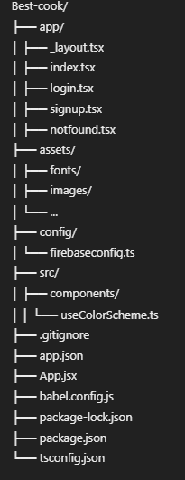

# Best-cook Project

## Overview

This project is an Expo React Native application for Best-cook-yum(will e changed). It includes a login screen, signup screen, and welcome screen.

## File Structure



## Key Files

- **`app/_layout.tsx`**: Default layout file for Expo Router.
- **`app/index.tsx`**: Main welcome screen.
- **`app/login.tsx`**: Screen component for login functionality.
- **`app/signup.tsx`**: Screen component for signup functionality.
- **`app/notfound.tsx`**: Custom 404 screen. -**`app/Appnavigator.tsx`**To navugate from welcome to signup to login page and can be modified. when all the the screens or page has been implemented we will work on navigating, for now i will just work on the log in.

## Instructions for Team Members

### Signup and Welcome Pages (Teammate)

- **Signup Page**: Christabel will Modify `app/signup.tsx`.
- **Welcome Page**: jiyeon will Modify `app/index.tsx`.
- You can create additional components or folders under `src/components` if needed.

### Login Page (Jiyeon's Task)

- **Login Page**: Jiyeon will Modify `app/login.tsx`.
- Feel free to create additional components or folders under `src/components` if needed.

## Running the Project

1. **Install Dependencies**:

   ```bash
   npm install
   ```

2. **run program**:
   ```terminal
   npm start
   ```
